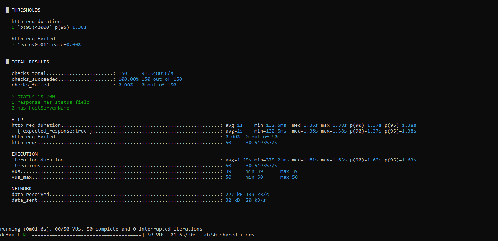
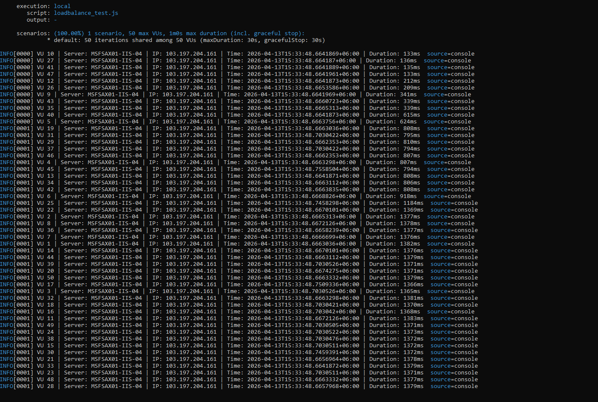

# API Performance & Stress Testing — K6

## Project Overview
This project demonstrates API stress testing using K6, a modern performance 
testing tool. The goal was to validate API endpoint stability, response 
integrity, and business logic accuracy under concurrent load of 50 virtual 
users.

## Tools & Technologies
- **K6** — Performance/stress testing
- **JavaScript** — Test scripting
- **Git & GitHub** — Version control and documentation


## Test Objectives
- Validate API stability under 50 concurrent virtual users
- Ensure response time stays within acceptable thresholds
- Verify business logic integrity through JSON response parsing
- Confirm zero error rate under stress conditions

## Test Configuration
| Parameter | Value |
|---|---|
| Virtual Users (VUs) | 50 |
| Iterations | 50 |
| Max Duration | 30s |

## Performance Thresholds
| Metric | Threshold | Result |
|---|---|---|
| p(95) Response Time | < 2000ms | 1380ms ✅ |
| Error Rate | < 1% | 0.00% ✅ |

## Validations Performed
- ✅ HTTP status code is 200
- ✅ Response body contains `"status": "Success"`
- ✅ Response contains `hostServerName` field

## Test Results Summary
| Metric | Value |
|---|---|
| Total Requests | 50 |
| Total Checks | 150 |
| Checks Passed | 150/150 (100%) |
| Checks Failed | 0 |
| Avg Response Time | 1s |
| Min Response Time | 132.5ms |
| Max Response Time | 1.38s |
| p(95) Response Time | 1.38s |
| Error Rate | 0.00% |

## Screenshots

### Threshold & Summary Report


### VU Execution Logs


## How to Run

### Prerequisites
- Install K6: https://k6.io/docs/getting-started/installation/

### Run the test
```bash
k6 run scripts/stress_test.js
```
## Project Structure

k6-api-performance-stress-testing/
│
├── scripts/
│   └── stress_test.js
│
├── reports/
│   └── summary_report.png
│   └── vu_logs.png
│
└── README.md

## Key Learnings
- Hands-on experience designing performance thresholds and interpreting 
  K6 metrics
- Validated API business logic under concurrent load through JSON 
  response parsing
- Understood behaviour of API endpoints under stress conditions including 
  response time distribution (avg, min, max, p95)